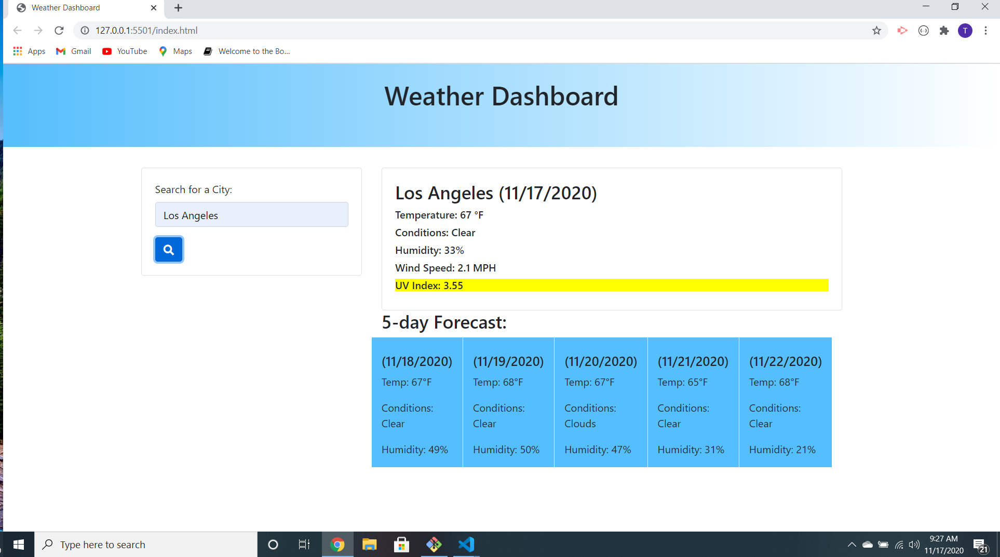
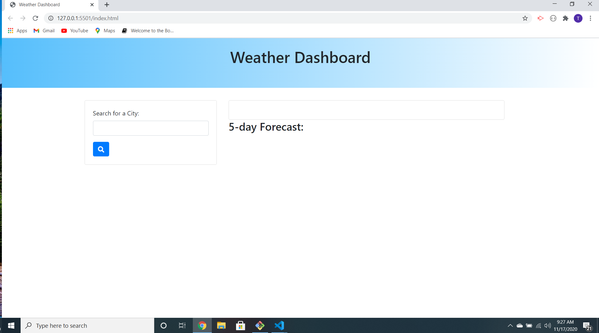

### Weather-Dashboard

### Motivation

* The motivation behind making this weather dashboard application is for ease of use and simple readability. From planning trips to planning important events, knowing the weather on any given day of the week is very important. Not only does this weather application show you the current weather in any city that you type into the search bar, it also gives you the future five day forecast. Knowing the forecast for the next week is very important to me for planning what can and will be done during the week according to weather. Sometimes you leave things in the backyard that aren't waterproof, so knowing the forecast for the next day allows you enough time to make accomadations so nothing gets ruined.

### Features

* This application has one main interaction between user and computer. That interaction is typing a city in the search bar and receiving the weather information for today and the next few days. It shows valuable information like the temperature, humidity, conditions, uv index, and windspeed for today and slightly less information for the next 5 days. 

### Build Status

* This build is currently near its final form. In future development I would like to put pictures instead of having the conditions in words. I would also like to add some more interavtive features for the user to see things such as hourly temperature.

### Screenshots

*
*